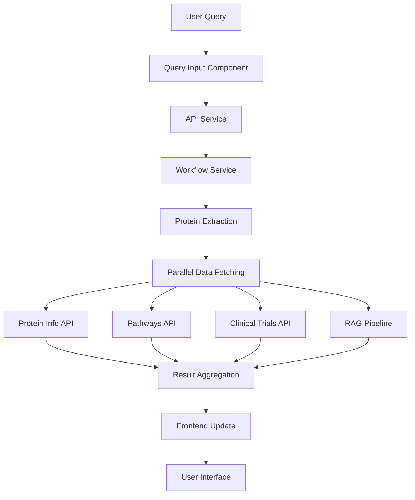
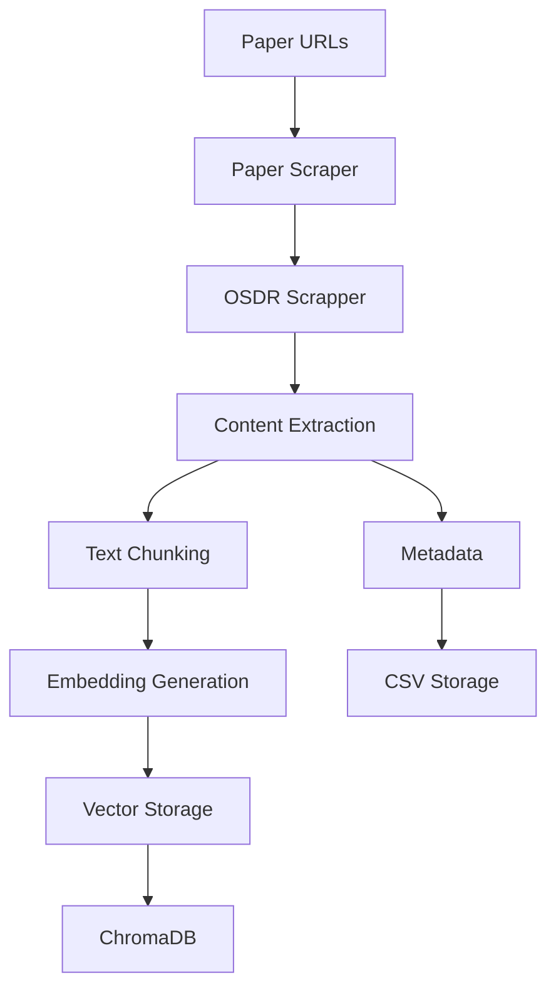

# SpacePath Architecture Documentation

## Table of Contents

- [System Overview](#system-overview)
- [Component Architecture](#component-architecture)
- [Data Flow](#data-flow)
- [Ingestion Pipeline](#ingestion-pipeline)
- [Retrieval System](#retrieval-system)
- [Reader System](#reader-system)
- [Bio Knowledge Module](#bio-knowledge-module)
- [Frontend Architecture](#frontend-architecture)
- [Data Storage](#data-storage)
- [Error Handling](#error-handling)
- [Performance Considerations](#performance-considerations)

## System Overview

SpacePath follows a modern microservices architecture with clear separation of concerns between data ingestion, processing, storage, and presentation layers.

```
┌─────────────────────────────────────────────────────────────────┐
│                        Frontend Layer                           │
│  ┌─────────────────┐  ┌─────────────────┐  ┌─────────────────┐  │
│  │   Query Input   │  │  Insights Panel │  │ Explorer Panel  │  │
│  │   (React)       │  │   (React)       │  │   (React)       │  │
│  └─────────────────┘  └─────────────────┘  └─────────────────┘  │
└─────────────────────────────────────────────────────────────────┘
                              │
                              │ HTTP/REST API
                              ▼
┌─────────────────────────────────────────────────────────────────┐
│                      API Gateway Layer                          │
│  ┌───────────────────────────────────────────────────────────┐  │
│  │                FastAPI Application                        │  │
│  │  ┌─────────────┐ ┌─────────────┐ ┌─────────────────────┐  │  │
│  │  │   Query     │ │  Protein    │ │    Research Summary │  │  │
│  │  │  Endpoints  │ │  Endpoints  │ │      Endpoints      │  │  │
│  │  └─────────────┘ └─────────────┘ └─────────────────────┘  │  │
│  └───────────────────────────────────────────────────────────┘  │
└─────────────────────────────────────────────────────────────────┘
                              │
                              ▼
┌─────────────────────────────────────────────────────────────────┐
│                    Business Logic Layer                         │
│  ┌─────────────────┐  ┌─────────────────┐  ┌─────────────────┐  │
│  │  Workflow       │  │   RAG Pipeline  │  │  LLM Service    │  │
│  │  Service        │  │                 │  │                 │  │
│  └─────────────────┘  └─────────────────┘  └─────────────────┘  │
│  ┌─────────────────┐  ┌─────────────────┐  ┌─────────────────┐  │
│  │  Protein        │  │  Paper Scraper  │  │  Structured     │  │
│  │  Utils          │  │                 │  │  Reader         │  │
│  └─────────────────┘  └─────────────────┘  └─────────────────┘  │
└─────────────────────────────────────────────────────────────────┘
                              │
                              ▼
┌─────────────────────────────────────────────────────────────────┐
│                      Data Storage Layer                         │
│  ┌─────────────────┐  ┌─────────────────┐  ┌─────────────────┐  │
│  │  Vector Store   │  │  Paper Metadata │  │  Knowledge      │  │
│  │  (ChromaDB)     │  │  (CSV/JSON)     │  │  Graph (JSON)   │  │
│  └─────────────────┘  └─────────────────┘  └─────────────────┘  │
└─────────────────────────────────────────────────────────────────┘
                              │
                              ▼
┌─────────────────────────────────────────────────────────────────┐
│                    External Data Sources                        │
│  ┌─────────────────┐  ┌─────────────────┐  ┌─────────────────┐  │
│  │   NASA APIs     │  │  Biological     │  │  Clinical       │  │
│  │  (OSDR, GeneLab)│  │  APIs (UniProt, │  │  APIs (Trials)  │  │
│  │                 │  │  KEGG)          │  │                 │  │
│  └─────────────────┘  └─────────────────┘  └─────────────────┘  │
└─────────────────────────────────────────────────────────────────┘
```

## Component Architecture

### 1. Frontend Layer (React/TypeScript)

**Components:**
- **QueryInput**: Natural language query interface with real-time suggestions
- **InsightsPanel**: Displays protein information, research summaries, and biological effects
- **ExplorerPanel**: Interactive data exploration with filtering and sorting
- **PathwaysViewer**: KEGG pathway visualization with space biology annotations
- **ClinicalTrialsList**: Clinical trial browser with search and filtering
- **RelationshipsGraph**: Interactive network visualization of protein relationships

**State Management:**
- **React Context**: Global application state
- **TanStack Query**: Server state management and caching
- **Custom Hooks**: Business logic encapsulation (useQueryWorkflow)

### 2. API Gateway Layer (FastAPI)

**Endpoints:**
```python
POST /query                    # Extract protein name from query
POST /get-protein-info         # Get protein details and clinical studies
POST /get-pathways            # Get KEGG pathways for protein
POST /get-research-summary    # Generate RAG-based research summary
GET  /health                  # Health check endpoint
```

**Middleware:**
- **CORS**: Cross-origin resource sharing for frontend integration
- **Logging**: Structured logging with request/response tracking
- **Error Handling**: Centralized error handling with proper HTTP status codes

### 3. Business Logic Layer

#### Workflow Service
Orchestrates the complete query processing pipeline:
1. **Protein Extraction**: Uses LLM to extract protein names from natural language
2. **Data Aggregation**: Coordinates calls to multiple data sources
3. **Result Synthesis**: Combines and formats results for frontend consumption

#### RAG Pipeline
Implements retrieval-augmented generation:
- **Document Retrieval**: Semantic search using ChromaDB
- **Context Assembly**: Combines relevant document chunks
- **Response Generation**: Uses LLM to generate contextual responses

#### LLM Service
Manages language model interactions:
- **Provider Abstraction**: Supports multiple LLM providers (OpenAI, Anthropic)
- **Prompt Management**: Centralized prompt templates and versioning
- **Response Processing**: Handles streaming and structured outputs

## Data Flow

### Query Processing Flow



### Data Ingestion Flow




## Retrieval System

### Hybrid Retrieval Architecture

```python
class HybridRetriever:
    def __init__(self):
        self.dense_retriever = ChromaDBRetriever()  # Semantic search
        self.sparse_retriever = BM25Retriever()     # Keyword search
        self.reranker = CrossEncoderReranker()      # Result reranking
    
    def retrieve(self, query: str, top_k: int = 10):
        # Dense retrieval for semantic similarity
        dense_results = self.dense_retriever.search(query, top_k * 2)
        
        # Sparse retrieval for keyword matching
        sparse_results = self.sparse_retriever.search(query, top_k * 2)
        
        # Combine and rerank results
        combined_results = self.combine_results(dense_results, sparse_results)
        reranked_results = self.reranker.rerank(query, combined_results)
        
        return reranked_results[:top_k]
```

### Vector Database Schema

**Collections:**
- **papers_collection**: Full paper documents for paper-level retrieval
- **chunks_collection**: Text chunks for passage-level retrieval

**Metadata Fields:**
```json
{
  "paper_id": "uuid",
  "title": "string",
  "authors": "string",
  "abstract": "string",
  "keywords": "string",
  "link": "url",
  "chunk_id": "uuid",
  "chunk_type": "abstract|results|methods|discussion",
  "publication_year": "integer"
}
```

## Reader System

### Structured Output Generation

The reader system uses LLM prompts to extract structured biological effects:

```python
class StructuredReader:
    def __init__(self, llm_service: LLMService):
        self.llm = llm_service
        self.prompt_template = """
        Extract biological effects from the following text:
        
        Text: {text}
        Target Protein: {protein}
        Condition: {condition}
        
        Extract the following information:
        1. Biological Effect
        2. Molecular Mechanism
        3. Experimental Evidence
        4. Confidence Level
        5. Space vs Earth Comparison
        """
    
    def extract_effects(self, text: str, protein: str, condition: str):
        prompt = self.prompt_template.format(
            text=text, protein=protein, condition=condition
        )
        response = self.llm.generate(prompt)
        return self.parse_structured_output(response)
```

### Biological Effect Schema

```json
{
  "effect_id": "uuid",
  "protein_name": "string",
  "biological_effect": "string",
  "molecular_mechanism": "string",
  "experimental_evidence": "string",
  "confidence_level": "high|medium|low",
  "space_conditions": "string",
  "earth_comparison": "string",
  "therapeutic_implications": "string",
  "source_document": "string",
  "extraction_timestamp": "datetime"
}
```

## Bio Knowledge Module

### External API Integration

#### UniProt Integration
```python
class UniProtClient:
    def get_protein_info(self, protein_name: str):
        # Search for protein by gene name
        search_url = "https://rest.uniprot.org/uniprotkb/search"
        params = {
            "query": f"gene:{protein_name} AND organism_id:9606",
            "fields": "accession,proteinDescription,genes,comments"
        }
        return self.make_request(search_url, params)
```

#### KEGG Integration
```python
class KEGGClient:
    def get_pathways(self, protein_name: str):
        # Get pathways for protein
        pathway_url = f"https://rest.kegg.jp/link/pathway/{protein_name}"
        return self.make_request(pathway_url)
```

#### Clinical Trials Integration
```python
class ClinicalTrialsClient:
    def search_trials(self, protein_name: str):
        # Search clinical trials by protein/drug name
        search_url = "https://clinicaltrials.gov/api/v2/studies"
        params = {
            "query": protein_name,
            "format": "json"
        }
        return self.make_request(search_url, params)
```

## Frontend Architecture

### Component Hierarchy

```
App
├── QueryInput
├── MainLayout
│   ├── InsightsPanel
│   │   ├── ProteinInfo
│   │   ├── ResearchSummary
│   │   └── BiologicalEffects
│   └── ExplorerPanel
│       ├── PathwaysViewer
│       ├── ClinicalTrialsList
│       └── RelationshipsGraph
└── ToastProvider
```

## Performance Considerations

### Backend Optimizations

1. **Async Processing**: All I/O operations are asynchronous
2. **Connection Pooling**: Reuse database and API connections
3. **Caching**: Redis for frequently accessed data
4. **Batch Processing**: Process multiple requests together

### Frontend Optimizations

1. **Code Splitting**: Lazy load components
2. **Memoization**: React.memo for expensive components
3. **Virtual Scrolling**: For large lists of results
4. **Progressive Loading**: Show partial results as they become available

### Database Optimizations

1. **Indexing**: Proper indexes on search fields
2. **Sharding**: Distribute data across multiple collections
3. **Compression**: Compress stored embeddings
4. **Cleanup**: Regular cleanup of old data

### Monitoring and Metrics

- **Response Times**: Track API response times
- **Error Rates**: Monitor error frequencies
- **Resource Usage**: CPU, memory, and storage usage
- **User Engagement**: Query patterns and success rates

---

*This architecture documentation provides a comprehensive overview of SpacePath's technical implementation. For specific implementation details, refer to the source code and API documentation.*
